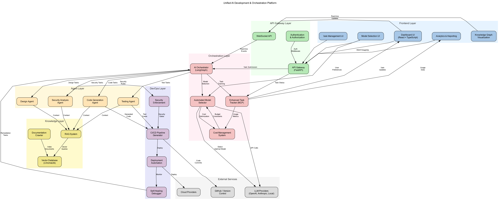

# TheMachine Architecture

This document provides a comprehensive overview of TheMachine's architecture, explaining how the different components work together to create a unified AI development and orchestration platform.

## System Overview

TheMachine integrates multiple components from various AI projects into a cohesive system with a layered architecture. The diagram below illustrates the high-level architecture:

## Layered Architecture

### 1. Frontend Layer

The Frontend Layer provides the user interface for interacting with TheMachine. It is built using React and TypeScript, with Tailwind CSS for styling.

Key components:
- **Dashboard UI**: Main interface for monitoring and managing AI tasks
- **Model Selection UI**: Interface for configuring model selection preferences
- **Task Management UI**: Interface for creating, monitoring, and managing tasks
- **Analytics & Reporting**: Visualizations and reports on system usage and performance
- **Knowledge Graph Visualization**: Visual representation of the knowledge graph

### 2. API Gateway Layer

The API Gateway Layer serves as the entry point for all client requests, routing them to the appropriate services.

Key components:
- **API Gateway**: FastAPI-based gateway that handles routing and request validation
- **WebSocket API**: Enables real-time updates and notifications
- **Authentication & Authorization**: Handles user authentication and permission management

### 3. Orchestration Layer

The Orchestration Layer coordinates the execution of tasks across the system, managing the lifecycle of AI agents and optimizing resource usage.

Key components:
- **AI Orchestrator**: LangGraph-based workflow engine that coordinates agent activities
- **Automated Model Selector**: Intelligently selects the most appropriate AI model based on task requirements and cost constraints
- **Enhanced Task Tracker**: MCP-based system for comprehensive task tracking
- **Cost Management System**: Monitors and optimizes AI model usage costs

### 4. Agent Layer

The Agent Layer contains specialized AI agents that perform specific tasks within the system.

Key components:
- **Code Generation Agent**: Generates code based on requirements
- **Design Agent**: Creates design artifacts and mockups
- **Testing Agent**: Generates and executes tests
- **Security Analysis Agent**: Analyzes code for security vulnerabilities

### 5. DevOps Layer

The DevOps Layer automates the deployment and operation of AI applications.

Key components:
- **CI/CD Pipeline Generator**: Creates customized CI/CD pipelines
- **Deployment Automation**: Automates the deployment of applications
- **Self-Healing Debugger**: Automatically detects and fixes common issues
- **Security Enforcement**: Enforces security policies and best practices

### 6. Knowledge Layer

The Knowledge Layer manages the system's knowledge base, providing context for AI operations.

Key components:
- **Vector Database**: ChromaDB-based storage for vector embeddings
- **RAG System**: Retrieval-Augmented Generation system for context-aware AI operations
- **Documentation Crawler**: Automatically indexes documentation and code

### 7. External Services

TheMachine integrates with various external services to extend its capabilities.

Key components:
- **LLM Providers**: Integration with OpenAI, Anthropic, and local LLM providers
- **GitHub / Version Control**: Integration with version control systems
- **Cloud Providers**: Integration with cloud platforms for deployment

## Data Flow

1. **Task Creation**:
   - User creates a task via the Frontend
   - Request is routed through the API Gateway
   - Task is registered with the Task Tracker
   - Orchestrator determines the execution plan

2. **Model Selection**:
   - Orchestrator requests model selection
   - Model Selector evaluates task requirements
   - Cost Management provides budget constraints
   - Optimal model is selected

3. **Task Execution**:
   - Orchestrator assigns task to appropriate agent(s)
   - Agents retrieve context from the Knowledge Layer
   - Agents execute the task using the selected model
   - Results are tracked and reported back

4. **Deployment**:
   - Code Generation Agent produces code
   - CI/CD Pipeline validates and tests the code
   - Security Enforcement checks for vulnerabilities
   - Deployment Automation deploys to target environment

## Integration Points

TheMachine integrates components from multiple projects:

1. **From AI-Orchestrator**:
   - Agent orchestration framework
   - Task management system
   - Cost tracking

2. **From AI-CICD-Platform**:
   - CI/CD pipeline generation
   - Security enforcement
   - Deployment automation
   - Self-healing debugger

3. **From Archon**:
   - LangGraph workflow engine
   - Pydantic AI integration
   - Documentation crawler

4. **From MCP Components**:
   - Enhanced task tracking
   - Project management
   - Automation tools

## Security Architecture

TheMachine implements security at multiple levels:

1. **Authentication & Authorization**:
   - JWT-based authentication
   - Role-based access control
   - API key management for service-to-service communication

2. **Data Security**:
   - Encryption at rest and in transit
   - Secure credential storage
   - Data isolation between tenants

3. **Code Security**:
   - Automated vulnerability scanning
   - Dependency analysis
   - Policy enforcement

4. **Operational Security**:
   - Audit logging
   - Anomaly detection
   - Regular security assessments

## Deployment Architecture

TheMachine can be deployed in various configurations:

1. **Development Environment**:
   - Docker Compose-based local deployment
   - Mock services for external dependencies
   - Hot reloading for rapid development

2. **Production Environment**:
   - Kubernetes-based deployment
   - Horizontal scaling for high availability
   - Load balancing and auto-scaling

3. **Hybrid Environment**:
   - Mix of cloud and on-premises components
   - Support for air-gapped environments
   - Edge deployment options

## Future Architecture Considerations

1. **Federated Learning**:
   - Support for distributed model training
   - Privacy-preserving learning techniques

2. **Multi-Modal Support**:
   - Integration with image, audio, and video processing
   - Cross-modal reasoning capabilities

3. **Edge Deployment**:
   - Optimized agents for edge devices
   - Offline operation capabilities
